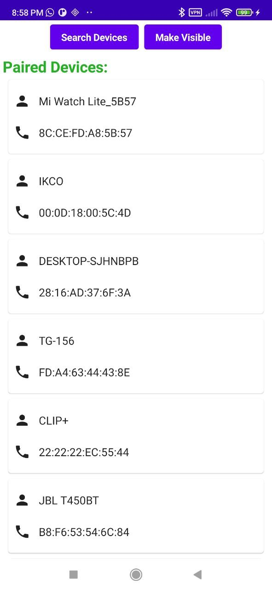
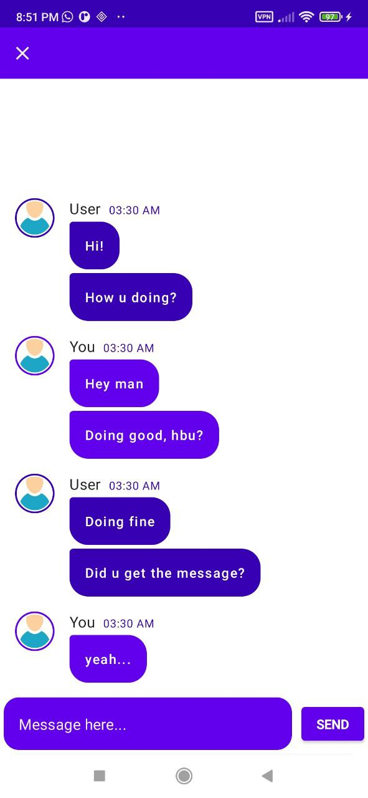

# BluetoothChatCompose01
## Developed by Mahdi Razzaghi Ghaleh
## Still working on it...
#### **Simple chat application by bluetooth socket in jetpack compose and MVI Architecture, Which is not finished yet since it has some small issues**

## Give a Star! ⭐
If you like or are using this project to learn or start your solution, please give it a star. Thanks!

| Main Screen | Chat Screen |  
| :---: | :---: | 
|  |   | 

### BluetoothAdapter:
**Represents the local device Bluetooth adapter.**

The BluetoothAdapter lets you perform fundamental Bluetooth tasks,
such as initiate device discovery, query a list of bonded (paired) devices,
instantiate a BluetoothDevice using a known MAC address,
and create a BluetoothServerSocket to listen for connection requests from other devices,
and start a scan for Bluetooth LE devices.

- To get a BluetoothAdapter representing the local Bluetooth adapter, call the BluetoothManager#getAdapter function on BluetoothManager.

**On JELLY_BEAN_MR1 and below you will need to use the static getDefaultAdapter() method instead.**

**Fundamentally, this is your starting point for all Bluetooth actions.**

- Once you have the local adapter, you can get a set of BluetoothDevice objects representing all paired devices with getBondedDevices();
start device discovery with startDiscovery();
or create a BluetoothServerSocket to listen for incoming RFComm connection requests with listenUsingRfcommWithServiceRecord(java.lang.String, java.util.UUID);
listen for incoming L2CAP Connection-oriented Channels (CoC) connection requests with listenUsingL2capChannel();
or start a scan for Bluetooth LE devices with startLeScan(android.bluetooth.BluetoothAdapter.LeScanCallback).

**This class is thread safe.**

### BluetoothSocket:
**A connected or connecting Bluetooth socket.**

- The interface for Bluetooth Sockets is similar to that of TCP sockets: Socket and ServerSocket.

- On the server side, use a BluetoothServerSocket to create a listening server socket.

- When a connection is accepted by the BluetoothServerSocket, it will return a new BluetoothSocket to manage the connection.

- On the client side, use a single BluetoothSocket to both initiate an outgoing connection and to manage the connection.

- The most common type of Bluetooth socket is RFCOMM, which is the type supported by the Android APIs.

- RFCOMM is a connection-oriented, streaming transport over Bluetooth. It is also known as the Serial Port Profile (SPP).

- To create a BluetoothSocket for connecting to a known device, use BluetoothDevice.createRfcommSocketToServiceRecord().

- Then call connect() to attempt a connection to the remote device.

- This call will block until a connection is established or the connection fails.

- To create a BluetoothSocket as a server (or "host"), see the BluetoothServerSocket documentation.

- Once the socket is connected, whether initiated as a client or accepted as a server,
open the IO streams by calling getInputStream() and getOutputStream() in order to retrieve InputStream and OutputStream objects, respectively, which are automatically connected to the socket.

**BluetoothSocket is thread safe.**

- In particular, close() will always immediately abort ongoing operations and close the socket.

### BluetoothServerSocket:
**A listening Bluetooth socket.**

- The interface for Bluetooth Sockets is similar to that of TCP sockets: Socket and ServerSocket.

- On the server side, use a BluetoothServerSocket to create a listening server socket.

- When a connection is accepted by the BluetoothServerSocket, it will return a new BluetoothSocket to manage the connection. On the client side, use a single BluetoothSocket to both initiate an outgoing connection and to manage the connection.

- For Bluetooth BR/EDR, the most common type of socket is RFCOMM,
which is the type supported by the Android APIs. RFCOMM is a connection-oriented,
streaming transport over Bluetooth BR/EDR.

- It is also known as the Serial Port Profile (SPP).

- To create a listening BluetoothServerSocket that's ready for incoming Bluetooth BR/EDR connections,
use BluetoothAdapter.listenUsingRfcommWithServiceRecord().

- For Bluetooth LE, the socket uses LE Connection-oriented Channel (CoC).

- LE CoC is a connection-oriented, streaming transport over Bluetooth LE and has a credit-based flow control.

- Correspondingly, use BluetoothAdapter.listenUsingL2capChannel() to create a listening BluetoothServerSocket that's ready for incoming Bluetooth LE CoC connections.
For LE CoC, you can use getPsm() to get the protocol/service multiplexer (PSM) value that the peer needs to use to connect to your socket.
After the listening BluetoothServerSocket is created, call accept() to listen for incoming connection requests.

- This call will block until a connection is established, at which point,
it will return a BluetoothSocket to manage the connection. Once the BluetoothSocket is acquired,
it's a good idea to call close() on the BluetoothServerSocket when it's no longer needed for accepting connections.

- Closing the BluetoothServerSocket will not close the returned BluetoothSocket.

**BluetoothServerSocket is thread safe.**

- In particular, close() will always immediately abort ongoing operations and close the server socket.

#### **Ideas**:
https://developer.android.com
